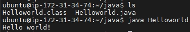
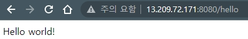

# Ubuntu 서버에서 Java 다루기
## Java
### 1. AWS EC2 기반 클라우드 Ubuntu 서버 인스턴스 구축
- 개인 AWS root계정으로 서울 region의 t2.micro 프리티어 EC2 구축 완료
### 2. Ubuntu 서버 접속
- 개인 pem키 사용하여 접속 완료
### 3. 기본 ubuntu 설정
- `sudo apt-get update && sudo-apt-get upgrade`: 기본 패키지 레포지토리 업데이트 및 업그레이드
- `sudo apt-get install openjdk-11-jdk-headless`: openjdk 기반 java 11 jdk를 설치
- `sudo apt-get install vim`: vim editor 설치
### 4. Helloworld.java 생성
```java
public class Helloworld {
    public static void main(String[] args) {
        System.out.println("Hello world!");
    }
}
```
### 5. javac로 compile 진행
- `javac Helloworld.java`
### 6. 생성된 Helloworld.class를 바탕으로 java로 실행
- `java Helloworld`
출력 결과:
```bash
Hello world!
```

## Java Spring Boot
### 1. Spring Boot 기반 프로젝트 생성(feat. spring.io starter)
- 이름: helloworld
- 패키지 이름: com.ktds
### 2. src > main > java > com.ktds.helloworld > HelloworldApplication.java 편집
```java
package com.ktds.helloworld;

import org.springframework.boot.SpringApplication;
import org.springframework.boot.autoconfigure.SpringBootApplication;
import org.springframework.boot.autoconfigure.jdbc.DataSourceAutoConfiguration;
import org.springframework.http.HttpStatus;
import org.springframework.http.ResponseEntity;
import org.springframework.web.bind.annotation.GetMapping;
import org.springframework.web.bind.annotation.RestController;

@RestController
@SpringBootApplication(exclude = DataSourceAutoConfiguration.class) // 해당 exclude를 넣어야만 data source 설정 없이 실행 가능
public class HelloworldApplication {

    @GetMapping("/hello") // 퍼블릭주소:8080/hello로 접속 시 Hello world! 출력.
    public ResponseEntity<String> helloworld() {
        return new ResponseEntity<>("Hello world!", HttpStatus.OK);
    }

    public static void main(String[] args) {
        SpringApplication.run(HelloworldApplication.class, args);
    }

}
```
### 3. 해당 프로젝트를 git으로 repository에 push.
### 4. 해당 프로젝트를 Ubuntu 서버에서 clone으로 내려받기.
### 5. gradlew 쉘 스크립트에 실행 권한 부여
- `chmod u+x gradlew`
### 6. Spring Boot 빌드 진행
- `gradlew bootJar`
### 7. build > libs에 위치해 있는 helloworld-0.0.1-SNAPSHOT.jar 파일을 실행
- `java -jar helloworld-0.0.1-SNAPSHOT.jar`
### 8. Spring Boot가 실행되고, 해당 서버에 접속하여 확인하기
- 사용자 로그아웃을 진행하더라도 계속해서 돌아가도록 다음과 같이 설정:
  - `nohup java -jar helloworld-0.0.1-SNAPSHOT.jar &`
  - 해당 명령어 수행 시 백그라운드로 실행되며, 사용자 로그아웃이 이루어지더라도 계속해서 돌아간다.
  - 현재 접속 가능한 주소: http://13.209.72.171:8080/hello  
실행 화면:
