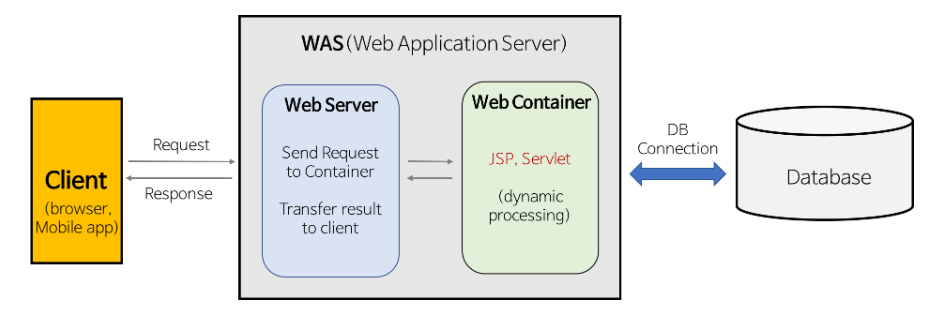
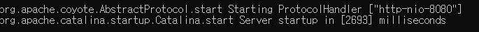
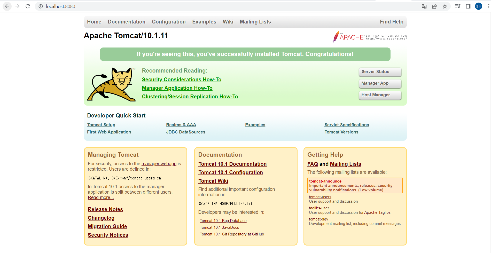

# Apache Tomcat 사용법
Apache Tomcat은 Apache사에서 제작한 WAS(Web application server)이다.  

## `.war` 파일을 사용하여 Apache Tomcat 기반으로 서버 배포하는 방법
1. `.war`파일로 빌드를 진행한다. 
2. Apache Tomcat을 설치한다.  
    - `wget https://dlcdn.apache.org/tomcat/tomcat-10/v10.1.11/bin/apache-tomcat-10.1.11.tar.gz`: Tomcat v10.1.11 다운로드.
    - `tar -xf <다운로드 받은 톰캣.tar.gz>`: 압축 해제
    - `sudo mv <압축 해제한 폴더> /opt/tomcat`: /opt/tomcat으로 압축 해제한 파일 옮기기
3. `.war` 파일을 Tomcat 내 webapps 디렉토리 안에 넣기
    - `sudo mv ./<.war 파일> /opt/tomcat/webapps`
4. `/opt/tomcat/bin 디렉토리 안으로 이동`
5. `./catalina.sh run` 으로 실행.

