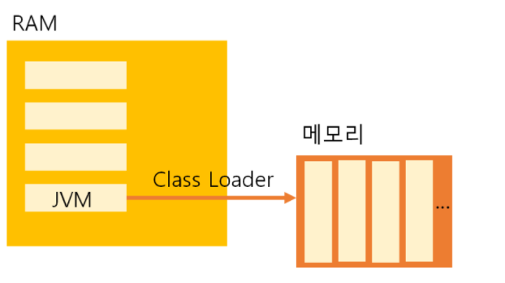
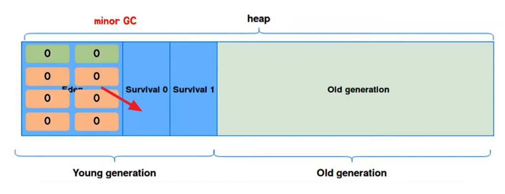

### JVM과 Java 메모리 구조
## JVM(Java Virtual Machine)의 작동 방식

1. Java로 개발된 프로그램을 실행하면 JVM은 OS로부터 메모리를 할당받는다.
2. 자바 컴파일러(javac)가 자바 소스코드(.java)를 자바 바이트코드(.class)로 컴파일한다.
3. Class loader를 통해 JVM Runtime Data Area로 로딩한다.
4. Runtime Data Area에 로드 된 .class들은 Execution Engine을 통해 해석된다.
5. 해석된 바이트코드는 Runtime Data Area의 각 영역에 배치되어 수행하며, 이 과정에서 Execution Engine에 의해 GC(garbage collector)의 작동과 스레드 동기화가 이루어진다.

### Class Loader란?

자바는 동적으로 클래스를 읽어오므로, 프로그램이 실행 중인 런타임에서야 모든 코드가 자바 가상버신과 연결된다. 이렇게 동적으로 클래스를 로딩해주는 역할을 수행하는 것을 class loader라고 한다. **Class loader는 .class 파일을 묶어서 JVM이 운영체제로부터 할당받은 메모리 영역인 Runtime Data Area로 적재한다.**

### Garbage Collection

객체들은 실질적으로 Heap영역에서 생성되고 Method Area이나 Stack Area등 Root Area에서는 Heap Area에 생성된 객체의 주소만 참조하는 형식으로 구성됩니다. 
하지만 이렇게 생성된 Heap Area의 객체들이 메서드가 끝나는 등의 특정 이벤트들로 인하여 Heap Area 객체의 메모리 주소를 가지고 있는 참조 변수가 삭제되는 현상이 발생하면 위의 그림에서의 빨간색 객체와 같이 Heap영역에서 어디서든 참조하고 있지 않은 객체들이 발생하게 됩니다. 
이러한 객체들을 Unreachable하다고 하며 주기적으로 가비지 컬렉터가 제거해줍니다.

### GC의 단점
1. 개발자가 메모리가 언제 해제되는지 정확하게 알 수 없다.
2. GC가 동작하는 동안에는 다른 동작을 멈추기 때문에 오버헤드가 발생한다. GC가 동작하는 시점에선 나머지 프로세스를 모두 중지 상태로 돌리기 때문.

객체가 처음 생성되고 Heap영역의 Eden에 age-bit 0으로 할당됩니다. 이 age-bit는 Minor GC에서 살아남을 때마다 1씩 증가하게 됩니다.

시간이 지나 Heap Area의 Eden 영역에 객체가 다 쌓이게 되면 Minor GC가 한번 일어나게 되고 참조 정도에 따라 Servivor0 영역으로 이동하거나 회수됩니다

계속해서 Eden영역에는 신규 객체들이 생성됩니다. 이렇게 또 Eden영역에 객체가 다 쌓이게 되면 Young Generation(Eden+Servivor) 영역에 있는 객체들을 비어있는 Survival인 Survival1 영역에 이동하고 살아남은 모든 객체들은 age가 1씩 증가합니다.

또다시 Eden 영역에 신규 객체들로 가득 차게 되면 다시한번 minor GC가 일어나고 Young Generation(Eden+Servivor) 영역에 있는 객체들을 비어있는 Survival인 Survival0으로 이동시킨 뒤 age를 1 증가시킵니다. 이 과정을 계속 반복합니다.

이 과정을 반복하다 보면 age bit가 특정 숫자 이상으로 되는 경우가 발생합니다. 이때 JVM에서 설정해놓은 age bit에 도달하게 되면 오랫동안 쓰일 객체라고 판단하고 Old generation 영역으로 이동시킵니다. 이 과정을 프로모션(Promotion)이라고 합니다.

시간이 지나 Old영역에 할당된 메모리가 허용치를 넘게 되면, Old 영역에 있는 모든 객체들을 검사하여 참조되지 않는 객체들을 한꺼번에 삭제하는 GC가 실행됩니다. 이렇게 Old generation영역의 메모리를 회수하는 GC를 Major GC라고 합니다. Major GC는 시간이 오래 걸리는 작업이고 이때 GC를 실행하는 스레드를 제외한 모든 스레드는 작업을 멈추게 됩니다. 이를 'Stop-the-World' 라 합니다. 이 작업이 너무 잦으면 프로그램 성능에 문제가 될 수 있습니다.