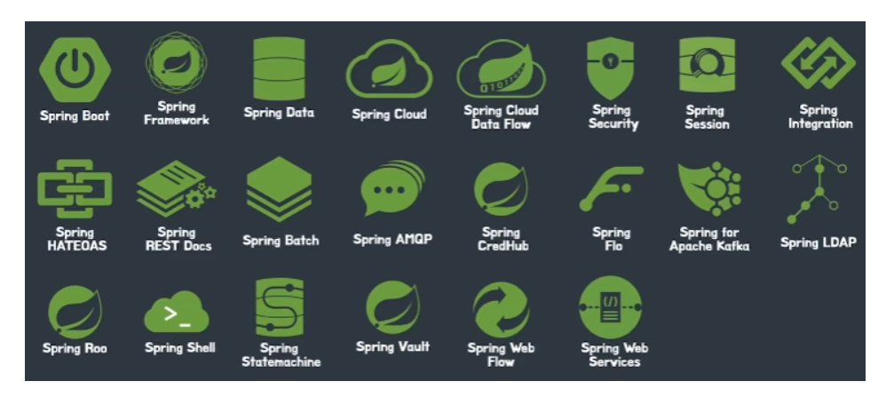
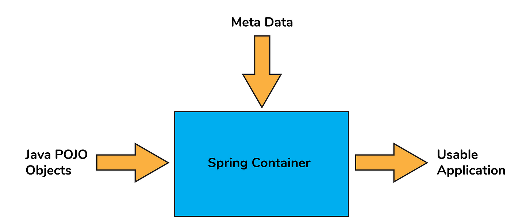
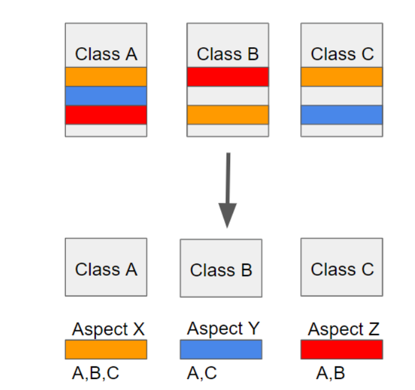
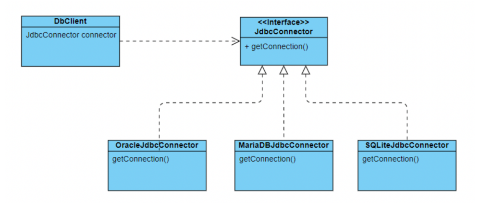

## 스프링 생태계
***************************************************************************************************************************************



## spring 
***************************************************************************************************************************************
- 의존성 주입(DI) 
- 제어 역전(IOC)
- 관점 지향 프로그래밍(AOP)


## 스프링 프레임워크 특징

- DI(Dependency Injection)
```
스프링이 다른 프레임워크와 차별화되어 제공하는 의존 관계 주입 기능으로, 
객체를 직접 생성하는 게 아니라 외부에서 생성한 후 주입 시켜주는 방식이다.
```

DI(의존성 주입)를 통해서 모듈 간의 결합도가 낮아지고 유연성이 높아진다.


첫번째 방법은 A객체가 B와 C객체를 New 생성자를 통해서 직접 생성하는 방법이고,

두번째 방법은 외부에서 생성 된 객체를 setter()를 통해 사용하는 방법이다.

- IoC(Inversion of Control):  
```
제어의 역전. Servlet이나 Bean 같은 코드를 개발자가 직접 작성해서 제어하지 않고, 프레임워크가 대신 수행해 주는 기능을 뜻한다. 
기존에는 자바 코드를 작성할 때 객체의 생성과 의존 관계 설정 등을  개발자가 직접 수행해야 했으나, 프레임워크가 대신 이를 수행한다.  
```   

  
Java의 POJO(Plain Old Java Object; 오래된 자바의 객체 형식)를 개발자가 작성하면 Bean, dependency 등을 프레임워크에서 처리해주어 사용가능한 애플리케이션 형태로 만들어주는 기능.

- 관점 지향 프로그래밍(AOP)
```
관점 지향적 프로그래밍. 어떤 로직을 기준으로 핵심적인 관점, 부가적인 관점을 구분하고, 그 관점을 기준으로 각각 모듈화한다는 관념. 
관점(Aspect) 단위로 모듈화하여 핵심적인 비즈니스 로직에서 분리하여 재사용 하겠다는 취지를 바탕으로 한다.
```



위의 A, B, C 클래스에서 동일한 색깔의 선들의 의미는 클래스들에 나타나는 비슷한(중복되는) 메소드, 필드, 코드들이 나타난다는 것입니다.
이러한 경우 만약 클래스 A에 주황색 부분을 수정해야 한다면 B, C 클래스들에 주황색 부분에 해당하는 곳을 찾아가 전부 코드를 수정해야 합니다. 
이런식으로 반복되는 코드를 흩어진 관심사 (Crosscutting Concerns)라 부릅니다.
 

이렇게 흩어진 관심사를 AOP는 Aspect를 이용해서 해결합니다. 위의 사진의 아래쪽을 보면 흩어져 있는 부분들을 Aspect를 이용해서 모듈화 시킨 것을 볼 수 있습니다. 
그리고 개발자가 모듈화 시킨 Aspect를 사진에서 위에 클래스에 어느 곳에 사용해야 하는지만 정의해주면 됩니다.

### PSA(Portable Service Abstraction):  

```
이동이 용이한 서비스 추상화. 특정 서비스를 제공할 때 규정되어 있는 인터페이스를 바탕으로 서비스를 구축함으로써, 일관된 방식으로 사용할 수 있도록 구현하여 서비스의 교체, 유지보수 차원에서 용이하게 해주는 방식.  
```
  

위와 같이 JDBC를 구축할 때, DB의 종류가 Oracle, MariaDB, SQLite 등 다양한 종류를 구축할 때 인터페이스를 상속받아 구축함으로써 교체 범주가 비즈니스 로직 전체가 아닌 상속 받은 특정 서비스 부분만 수정해도 교체가 되도록 해 준다.

## 스프링 프레임워크가 가졌던 문제들
- 설정할 게 너무나 많다.

- 의존성 관리가 힘들다
  - 스프링 프로젝트는 보통 독립적으로 돌아가는 게 아니라, 다양한 의존성과 함께 돌아가는데 스프링 버전이 계속 올라감에 따라 호환이 되는 의존성과 그렇지 않은 의존성을 반드시 구분해서 의존성을 추가해야 했다. 이러한 작업들이 개발자를 매우 피곤하게 했다.

- 배포가 어렵다
  - 스프링 프로젝트는 .war 파일을 추출하여 해당 파일을 톰캣 안의 특정 폴더로 넣어서 배포했다.
    스프링 프로젝트에서 추출한 .war 파일은 WAS 없이 독립적으로 실행이 불가능해서
    항상 WAS를 먼저 설치하고 그 안에 .war 파일을 넣어 배포했었다.

## 스프링 부트 해결
- 자동설정
AutoConfiguration (자동 설정) 애노테이션들
@SpringBootApplication
    - @SpringBootConfiguration, @EnableAutoConfiguration, @ComponentScan 래핑
    - @SpringBootConfiguration: 스프링 부트의 설정을 나타내는 어노테이션이다. 스프링의 @Configuration을 대체하며 스프링 부트 전용 어노테이션이다. 테스트 어노테이션을 사용할 때 계속 이 어노테이션을 찾기 때문에 스프링 부트에서는 필수 어노테이션이다.
    - @EnableAutoConfiguration: 자동 설정의 핵심 어노테이션이다. 클래스 경로에 지정된 내용을 기반으로 설정 자동화를 수행한다.
    
    - @ComponentScan: basePackages 프로퍼티 값에 별도의 경로를 설정하지 않으면 해당 어노테이션이 위치한 패키지가 루트 경로가 된다

- 의존성 관리
starter 를 통한 dependency 자동화 

- 배포
내부 톰캣을 사용하기 때문에 톰캣을 설치하거나 매번 버전 관리를 하지 않아도 된다