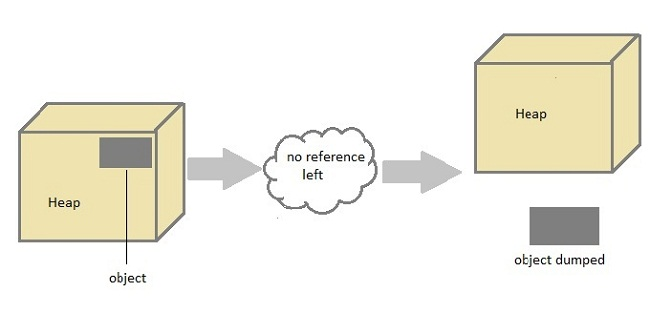

# JVM과 Java 메모리 구조
## JVM(Java Virtual Machine)의 작동 방식

1. Java로 개발된 프로그램을 실행하면 JVM은 OS로부터 메모리를 할당받는다.
2. 자바 컴파일러(javac)가 자바 소스코드(.java)를 자바 바이트코드(.class)로 컴파일한다.
3. Class loader를 통해 JVM Runtime Data Area로 로딩한다.
4. Runtime Data Area에 로드 된 .class들은 Execution Engine을 통해 해석된다.
5. 해석된 바이트코드는 Runtime Data Area의 각 영역에 배치되어 수행하며, 이 과정에서 Execution Engine에 의해 GC(garbage collector)의 작동과 스레드 동기화가 이루어진다.
### Class Loader란?

자바는 동적으로 클래스를 읽어오므로, 프로그램이 실행 중인 런타임에서야 모든 코드가 자바 가상버신과 연결된다. 이렇게 동적으로 클래스를 로딩해주는 역할을 수행하는 것을 class loader라고 한다. **Class loader는 .class 파일을 묶어서 JVM이 운영체제로부터 할당받은 메모리 영역인 Runtime Data Area로 적재한다.**
### Execution Engine이란?
Execution engine은 .class 파일(바이트코드)에 기재된 내용에 따라 바이트코드를 실행시키는 런타임 모듈을 뜻한다. Execution engine은 바이트코드를 명령어 단위로 읽어서 실행한다.
### Garbage Collection

더는 사용하지 않는 메모리를 자동으로 회수하는 JVM의 도구로, 개발자가 메모리 관리를 하지 않아도 되어 손쉽게 프로그램이을 할 수 있도록 해준다. Heap 메모리 영역에 생성 및 적재된 객체들 중에 참조되지 않은 객체들을 탐색 후 제거하는 역할을 수행한다. **해당 역할을 하는 시간은 알 수 없다.**
#### GC의 단점
1. 개발자가 메모리가 언제 해제되는지 정확하게 알 수 없다.
2. GC가 동작하는 동안에는 다른 동작을 멈추기 때문에 오버헤드가 발생한다. GC가 동작하는 시점에선 나머지 프로세스를 모두 중지 상태로 돌리기 때문.

#### GC 튜닝
- GC의 종류
  - `-XX:+UseParallelGC`: Parallel garbage collector 사용; 멀티쓰레드 형식의 애플리케이션에 적합.
  - `-XX:+UseG1GC`: Garbage-First garbage collector 사용; heap 메모리가 큰 애플리케이션에 적합하며, gc 과정에서 중단되는 시점을 예측하기 용이.
  - `-XX:+UseConcMarkSweepGC`: Concurrent Mark-Sweep garbage collector 사용; gc 수행 횟수를 최소화 하는 알고리즘으로, 실시간 유지성이 필요한 애플리케이션에 적합.
- GC 성능 튜닝
  - `-XX:NewRatio`: young과 old generation간의 비율값(ratio)을 조정한다.
    - ex) `-XX:NewRatio=2`: young:old = 1:2 비율로 조정하여 young generation이 총 heap 메모리의 1/3을 차지하도록 튜닝.
  - `-XX:MaxGCPauseMilis`: GC를 수행하는 과정에서 발생하는 pause 시간을 제한한다. 해당 튜닝은 gc 알고리즘 종류 선택과 조합하여 사용된다.
  - `-XX:GCTimeRatio`: gc시간과 application 수행 시간의 비율(ratio)을 정한다.
    - ex) `-XX:GCTimeRatio=19`: JVM은 전체 프로그램 수행 시간의 1/20을 gc에 소모하도록 튜닝.