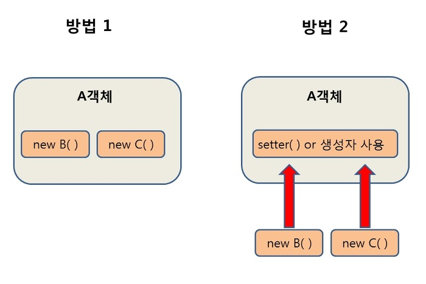
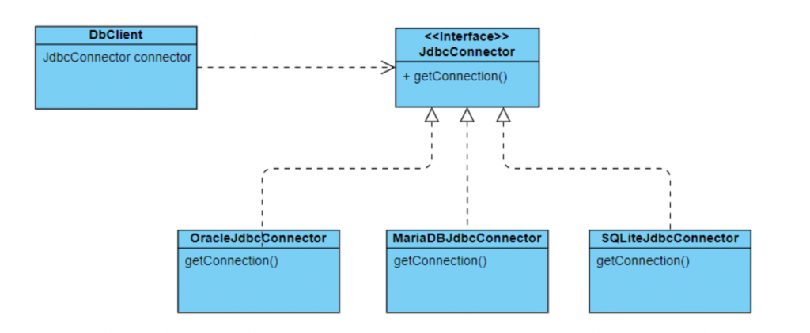

# Spring과 Spring Boot의 차이점
## Spring Framework의 특징
### DI(Dependency Injection):  
의존성 주입 기능으로, 객체를 직접 생성(new)해서 쓰는 것이 아니라, 외부에서 생성한 후 주입 시켜주는 방식을 말한다.  
DI를 통해서 모듈간의 결합도를 낮추고 유연성을 높힐 수 있다.
  
방법 2와 같이 외부에서 생성한 B, C 객체를 생성자 또는 setter를 활용하여 주입해서 사용한다.
### IoC(Inversion of Control):  
제어의 역전. Servlet이나 Bean 같은 코드를 개발자가 직접 작성해서 제어하지 않고, 프레임워크가 대신 수행해 주는 기능을 뜻한다. 기존에는 자바 코드를 작성할 때 객체의 생성과 의존 관계 설정 등을 개발자가 직접 수행해야 했으나, 프레임워크가 대신 이를 수행한다.  
  
Java의 POJO(Plain Old Java Object; 오래된 자바의 객체 형식)를 개발자가 작성하면 Bean, dependency 등을 프레임워크에서 처리해주어 사용가능한 애플리케이션 형태로 만들어주는 기능.
### AOP(Aspect Oriented Programming):  
관점 지향적 프로그래밍. 어떤 로직을 기준으로 핵심적인 관점, 부가적인 관점을 구분하고, 그 관점을 기준으로 각각 모듈화한다는 관념. 관점(Aspect) 단위로 모듈화하여 핵심적인 비즈니스 로직에서 분리하여 재사용 하겠다는 취지를 바탕으로 한다.  
ex) spring security나 logging(log4j) 기능을 추가할 때, 기존의 비즈니스 로직을 건들지 않고 단순한 어노테이션 추가를 통해 모듈을 붙혀 적용할 수 있다(재사용성, 모듈화).
### PSA(Portable Service Abstraction):  
이동이 용이한 서비스 추상화. 특정 서비스를 제공할 때 규정되어 있는 인터페이스를 바탕으로 서비스를 구축함으로써, 일관된 방식으로 사용할 수 있도록 구현하여 서비스의 교체, 유지보수 차원에서 용이하게 해주는 방식.  
  
위와 같이 JDBC를 구축할 때, DB의 종류가 Oracle, MariaDB, SQLite 등 다양한 종류를 구축할 때 인터페이스를 상속받아 구축함으로써 교체 범주가 비즈니스 로직 전체가 아닌 상속 받은 특정 서비스 부분만 수정해도 교체가 되도록 해 준다.
## Spring Boot Framework
Spring Boot는 Spring 기반 애플리케이션을 단독적으로(stand-alone), 상용화 수준으로(production-grade) 실행가능한 정도로 쉽게 만들어주는 프레임워크이다.
### 등장 배경
Spring Framework의 문제점은 다음과 같다.
- **설정할게 너무 많다.** Bean마다 다량의 xml 코드를 편집해야 했고, 연결 관계를 구축하는 과정에서 구현 난이도가 높다.
- **의존성 관리가 힘들다.** 의존성 여부에 따른 호환성 체크가 매번 이루어지면서 교체 작업이나 업그레이드가 불편하다.
- **배포가 어렵다.** 항상 `.war`파일을 추출하여 해당 파일을 Tomcat 안의 특정 폴더에 배치하여 배포해야 한다. `.war`파일은 WAS 없이 독립적으로 실행이 불가능하다.
### 한 눈에 보는 spring과 spring boot의 차이점
| |spring|spring boot|
|-|------|-----------|
|주 목적|자바 기반 애플리케이션 개발|REST API 개발|
|주요 기능|의존성 주입|AutoConfiguration|
|개발 유형|느슨하게 결합된 애플리케이션의 개발|독립 실행형 애플리캐이션 개발|
|서버 종속성|서버를 명시적으로 설정해야 함|Tomcat이나 Jetty 같은 임베디드 서버 제공|
## 총정리
### DI(Dependency Injection)
객체간의 결합도를 낮추어 코드 재사용성을 향상시키고, 단위테스트를 용이하게 하고 싶다!  
&rightarrow; **Spring에서 DI 도입.**  
&rightarrow; 그런데 매번 bean마다 설정을 해줘야하고, 의존성 관련 설정이 너무 많아서 설정이 힘들다!  
&rightarrow; **Spring Boot에서 AutoConfiguration과 starter 도입.**
  - AutoConfiguration: 각종 Spring bean 설정 자동화. META-INF 내부에 구현되어 있던 설정들을 자동화하고, 자동 설정 리스트를 구현할 필요가 없음.
  - starter: 의존성과 설정을 자동화해주는 모듈.
  - dependency-management: 의존성 호환 버전을 자동 관리.
### 중복된 코드 제거(Duplicated & Plumbing code removal)
코드를 너무 반복적으로 작성해야 하는데, 이를 줄일 수 없을까?  
&rightarrow; **Spring 에서 Boilerplate code, plumbing code를 제거.**
### 애플리케이션 배포
자바 애플리케이션을 만들고 배포하고 싶다.  
&rightarrow; **Spring에서 `.war` 빌드 후, WAS 설정 파일에 넣어 배포**  
&rightarrow; 매번 WAS를 설정하고 `.war`를 빌드해서 넣어주는게 귀찮다!  
&rightarrow; **Spring Boot에서 자체 내장 Tomcat(or Jetty)서버를 제공**
  - `.war`가 아닌 `.jar`를 통해 내장 Tomcat 서버를 품은 채 애플리케이션을 배포할 수 있다.
