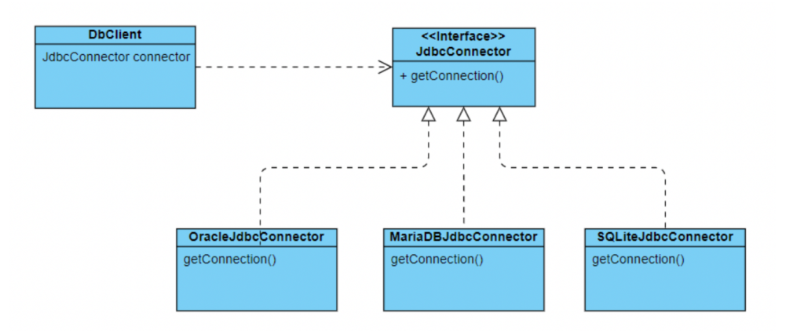

# Spring vs Springboot
## Spring이란?  
### 엔터프라이즈용 Java 어플리케이션 개발을 편하게 할 수 있게 해주는 오픈소스 경량급 애플리케이션 프레임워크

- 개발 초기에 기본적인 설정과 적용시킬 기술들만 잘 선택해준다면, 기술보다는 애플리케이션의 로직 자체에 더 집중하여 비즈니스 로직 구현 가능

- 오픈소스 프레임워크이지만, 안정적인 개발과 개선이 보장됨

- 불가피하게 작성해야만 했던 불필요하게 복잡한 코드를 제거하여 코드의 복잡성을 낮출 수 있음

### POJO 프로그래밍을 지향
- 다른 기술을 사용하지 않는 순수한 Java만을 사용하여 만든 객체

- 외부 라이브러리의 메서드를 사용한다면 그 기술이 업데이트될 때 해당 기술을 사용하고 있는 모든 객체들의 코드를 전부 바꿔주어야 한다.

- 따라서 POJO에서는 보다 유연하게 변화와 확장에 대처 가능

## IOC(Inversion Of Control) / DI(Dependency Injection) 
- A 인스턴스가 B 인스턴스의 메서드를 호출하고 있다면 "A가 B에 의존하는 관계" 라고 표현 가능

```java
// (1) A가 사용하는 메서드를 인터페이스 I의 추상 메서드로 정의한 다음 (추상화)
interface I {
    void example();
}

class A {

    // (3) 그 다음, 인터페이스 타입의 필드를 선언하고,
    private I i;

    // (4) 생성자를 통해 외부로부터 인스턴스를 받아와 i를 초기화 (다형성)
    public A(I i) {
        this.i = i;
    }

    public void methodOfA() {

        // (5) 외부로부터 받아온 인스턴스의 메서드를 호출
        i.example();
    }
}

// (2) A가 사용하는 메서드를 가진 객체들이 I를 구현하도록 함
class B implements I {

    public void example() {
        ...
    }
}
```

- 스프링에서 설정 클래스 파일에 A가 사용할 객체를 B로 설정해주면 애플리케이션이 동작하면서 B 객체를 생성하여 A의 생성자의 인자로 B를 전달해줌  

## AOP(Aspect Oriented Programming) 관점 지향 프로그래밍

```java
class OrderApp {

    ...

    public void 주문하기() {
        // 공통 관심 사항
        로깅 관련 코드
        보안 관련 코드

        // 핵심 관심 사항
        주문 관련 로직
    }

    public void 주문_변경하기() {

        // 공통 관심 사항
        로깅 관련 코드
        보안 관련 코드

        // 핵심 관심 사항
        주문 변경 관련 로직
    }

}

```

- 핵심 관심사항과 공통 관심사항들이 함께 모여 있으면 공통 관심사항과 관련된 코드가 중복될 수밖에 없음

- 따라서 공통 관심사항을 수행하는 로직이 변경되면 모든 중복 코드를 찾아서 일일이 수정해주어야 한다

- 애플리케이션 전반에 걸쳐 적용되는 공통 기능을 비즈니스 로직으로부터 분리해내는 것을 AOP 라고 한다.


## PSA(Portable Service Abstraction) 일관된 서비스 추상화

- 스프링이 데이터베이스 서비스를 추상화한 인터페이스를 제공해주기 때문에 스프링을 사용하면 동일한 사용방법을 유지한 채로 데이터베이스를 바꿀 수 있다. -> JDBC

- JDBC를 기반으로 하여 데이터베이스 접근 코드를 작성해두면, 이후에 데이터베이스를 바꾸어도 기존에 작성한 데이터베이스 접근 로직을 그대로 사용할 수 있다.

- JDBC처럼 특정 기술과 관련된 서비스를 추상화하여 일관된 방식으로 사용할 수 있도록 하는 것을 PSA라고 한다.


## Springboot 란?

- 스프링으로 애플링케이션을 만들 때 필요한 설정을 간편하게 처리해주는 별도의 프레임워크


