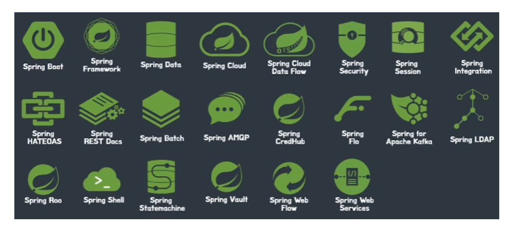
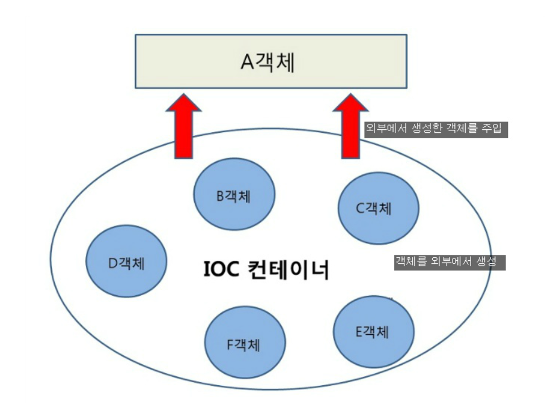
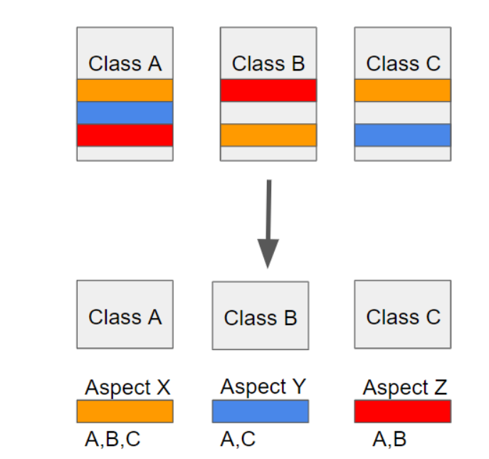

### 스프링 생태계

# spring 
- 의존성 주입(DI) 
- 제어 역전(IOC)
- 관점 지향 프로그래밍(AOP)
위의 요소들을 통해 느슨한 결합

### 의존성 주입(Dependency Injection)

DI(Dependency Injection)란 스프링이 다른 프레임워크와 차별화되어 제공하는 의존 관계 주입 기능으로,
객체를 직접 생성하는 게 아니라 외부에서 생성한 후 주입 시켜주는 방식이다.

DI(의존성 주입)를 통해서 모듈 간의 결합도가 낮아지고 유연성이 높아진다.

첫번째 방법은 A객체가 B와 C객체를 New 생성자를 통해서 직접 생성하는 방법이고,

두번째 방법은 외부에서 생성 된 객체를 setter()를 통해 사용하는 방법이다.

스프링에서는 객체를 Bean이라고 부르며, 프로젝트가 실행될때 사용자가 Bean으로 관리하는 객체들의 생성과 소멸에 관련된 작업을 자동적으로 수행해주는데 객체가 생성되는 곳을 스프링에서는 Bean 컨테이너라고 부른다.

### 제어역전(IOC)
IoC(Inversion of Control)란 "제어의 역전" 이라는 의미로, 말 그대로 메소드나 객체의 호출작업을 개발자가 결정하는 것이 아니라, 외부에서 결정되는 것을 의미한다.

IoC는 제어의 역전이라고 말하며, 간단히 말해 "제어의 흐름을 바꾼다"라고 한다.

### 관점 지향 프로그래밍 (AOP)

위의 A, B, C 클래스에서 동일한 색깔의 선들의 의미는 클래스들에 나타나는 비슷한(중복되는) 메소드, 필드, 코드들이 나타난다는 것입니다.
이러한 경우 만약 클래스 A에 주황색 부분을 수정해야 한다면 B, C 클래스들에 주황색 부분에 해당하는 곳을 찾아가 전부 코드를 수정해야 합니다. 
이런식으로 반복되는 코드를 흩어진 관심사 (Crosscutting Concerns)라 부릅니다.
 

이렇게 흩어진 관심사를 AOP는 Aspect를 이용해서 해결합니다. 위의 사진의 아래쪽을 보면 흩어져 있는 부분들을 Aspect를 이용해서 모듈화 시킨 것을 볼 수 있습니다. 
그리고 개발자가 모듈화 시킨 Aspect를 사진에서 위에 클래스에 어느 곳에 사용해야 하는지만 정의해주면 됩니다.

## 스프링 경량 특징

경량급 
존에 스프링 대신 사용하던 기술들과 비교하여, 스프링을 사용했을 때에 개발자가 작성해야 할 코드가 상대적으로 단순하다
스프링을 사용함으로써 기존 기술을 사용할 때에 불가피하게 작성해야만 했던 불필요하게 복잡한 코드를 제거하여 코드의 복잡성을 낮출 수 있음

## 스프링 프레임워크가 가졌던 문제들
- 설정할 게 너무나 많다.

- 의존성 관리가 힘들다

스프링 프로젝트는 보통 독립적으로 돌아가는 게 아니라, 다양한 의존성과 함께 돌아가는데 스프링 버전이 계속 올라감에 따라 호환이 되는 의존성과 그렇지 않은 의존성을 반드시 구분해서 의존성을 추가해야 했다. 이러한 작업들이 개발자를 매우 피곤하게 했다.

- 배포가 어렵다
스프링 프로젝트는 .war 파일을 추출하여 해당 파일을 톰캣 안의 특정 폴더로 넣어서 배포했다.
스프링 프로젝트에서 추출한 .war 파일은 WAS 없이 독립적으로 실행이 불가능해서 
항상 WAS를 먼저 설치하고 그 안에 .war 파일을 넣어 배포했었다.

## 스프링 부트 해결
- 자동설정
AutoConfiguration (자동 설정) 애노테이션들
@SpringBootApplication
    - @SpringBootConfiguration, @EnableAutoConfiguration, @ComponentScan 래핑
    - @SpringBootConfiguration: 스프링 부트의 설정을 나타내는 어노테이션이다. 스프링의 @Configuration을 대체하며 스프링 부트 전용 어노테이션이다. 테스트 어노테이션을 사용할 때 계속 이 어노테이션을 찾기 때문에 스프링 부트에서는 필수 어노테이션이다.
    - @EnableAutoConfiguration: 자동 설정의 핵심 어노테이션이다. 클래스 경로에 지정된 내용을 기반으로 설정 자동화를 수행한다.
    
    - @ComponentScan: basePackages 프로퍼티 값에 별도의 경로를 설정하지 않으면 해당 어노테이션이 위치한 패키지가 루트 경로가 된다

- 의존성 관리
starter 를 통한 dependency 자동화 

- 배포
내부 톰캣을 사용하기 때문에 톰캣을 설치하거나 매번 버전 관리를 하지 않아도 된다

